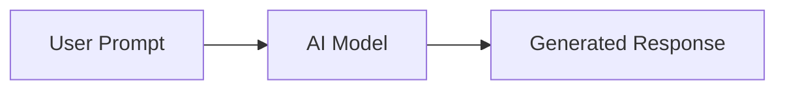
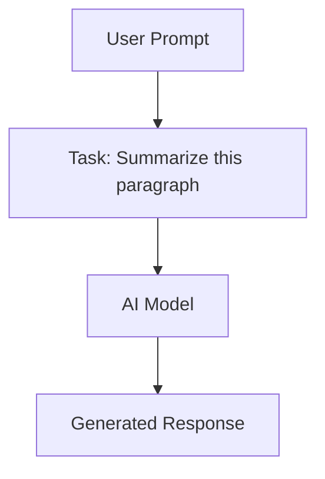
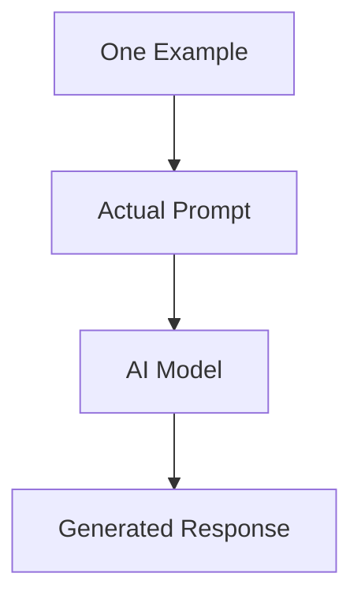
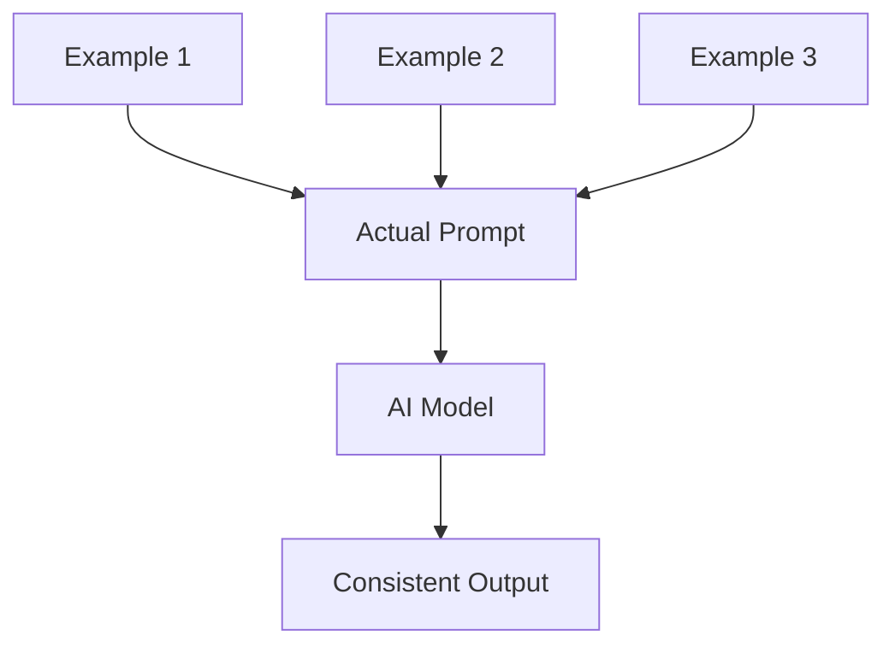
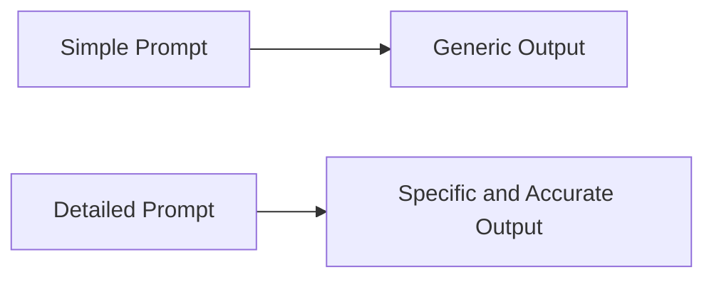
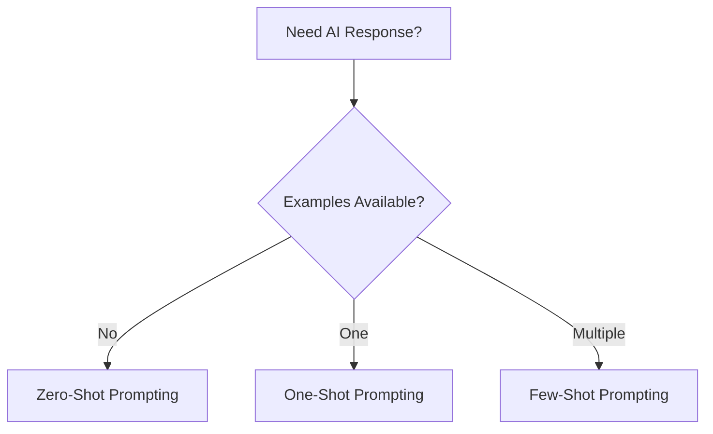
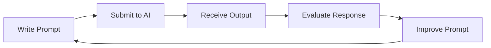
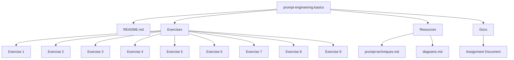
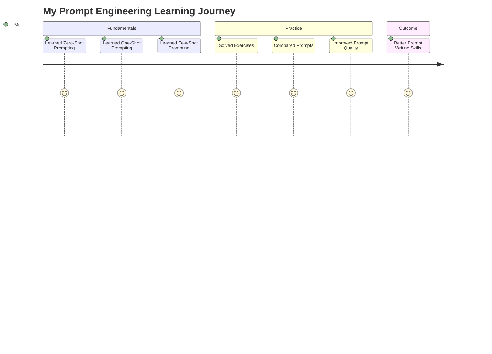
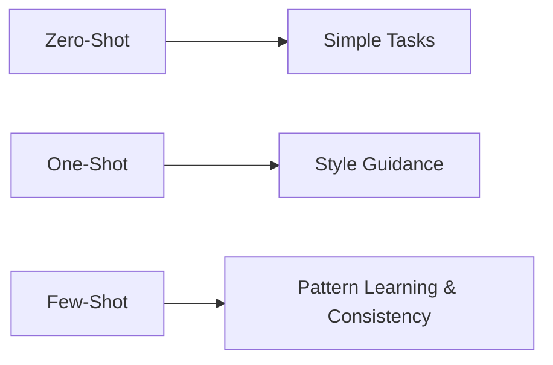

# Prompt Engineering Diagrams

This document contains visual diagrams that explain the core Prompt Engineering techniques using Mermaid. GitHub automatically renders these diagrams.

---

# 1. Prompt Engineering Workflow

---

# 2. Zero-Shot Prompting

### Explanation

- No examples are provided.
- The AI relies entirely on its pre-trained knowledge.

---

# 3. One-Shot Prompting

### Explanation

- A single example teaches the AI the expected response style.
- The AI follows that pattern for the new prompt.

---

# 4. Few-Shot Prompting

### Explanation

- Multiple examples are provided.
- The AI identifies patterns and produces more consistent responses.

---

# 5. Prompt Quality Comparison

### Explanation

A detailed prompt provides more context, allowing the AI to generate higher-quality responses.

---

# 6. Choosing the Right Prompt Technique

---

# 7. Prompt Engineering Lifecycle

### Explanation

Prompt engineering is an iterative process. Better prompts generally lead to better AI responses.

---

# 8. Repository Structure

---

# 9. Learning Journey

---

# 10. Prompt Technique Comparison

---

# Summary

| Technique | Examples Given | Best Use Case |
|------------|----------------|---------------|
| Zero-Shot Prompting | None | Simple tasks |
| One-Shot Prompting | One Example | Learning response style |
| Few-Shot Prompting | Multiple Examples | Consistent outputs and pattern recognition |
